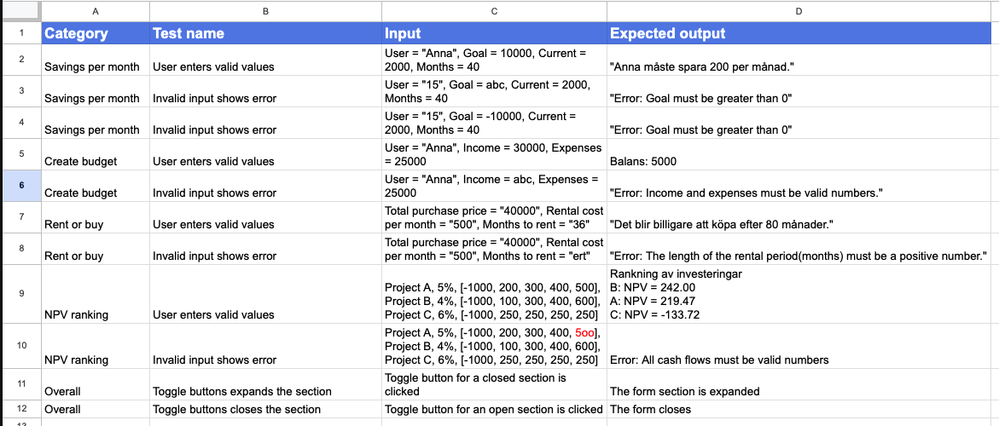

## Test cases for the application

### Text version of table
NOTE: Generated by ChatGPT

| **Category** | **Test name** | **Input** | **Expected output** |
|---|---|---|---|
| Savings per month | User enters valid values | User = "Anna", Goal = 10000, Current = 2000, Months = 40 | "Anna måste spara 200 per månad." |
| Savings per month | Invalid input shows error | User = "15", Goal = abc, Current = 2000, Months = 40 | "Error: Goal must be greater than 0" |
| Savings per month | Invalid input shows error | User = "15", Goal = -10000, Current = 2000, Months = 40 | "Error: Goal must be greater than 0" |
| Create budget | User enters valid values | User = "Anna", Income = 30000, Expenses = 25000 | Balans: 5000 |
| Create budget | Invalid input shows error | User = "Anna", Income = abc, Expenses = 25000 | "Error: Income and expenses must be valid numbers." |
| Rent or buy | User enters valid values | Total purchase price = "40000", Rental cost per month = "500", Months to rent = "36" | "Det blir billigare att köpa efter 80 månader." |
| Rent or buy | Invalid input shows error | Total purchase price = "40000", Rental cost per month = "500", Months to rent = "ert" | "Error: The length of the rental period(months) must be a positive number." |
| NPV ranking | User enters valid values | Project A, 5%, [-1000, 200, 300, 400, 500], Project B, 4%, [-1000, 100, 300, 400, 600], Project C, 6%, [-1000, 250, 250, 250, 250] | "Rankning av investeringar B: NPV = 242.00 A: NPV = 219.47 C: NPV = -133.72" |
| NPV ranking | Invalid input shows error | Project A, 5%, [-1000, 200, 300, 400, 5oo], Project B, 4%, [-1000, 100, 300, 400, 600], Project C, 6%, [-1000, 250, 250, 250, 250] | Error: All cash flows must be valid numbers |
| Overall | Toggle buttons expands the section | Toggle button for a closed section is clicked | The form section is expanded |
| Overall | Toggle buttons closes the section | Toggle button for an open section is clicked | The form closes |

